# BallVsBall: Ball Catalog

Current ability descriptions for all 26 balls. Pumpkin Ball is a playtime unlock.

| Ball | Icon | Ability |
|---|:---:|---|
| **Verity** |  | Taking a hit has a 19% chance to trigger 10 seconds of Rage. Rage increases size by 38% and contact damage to 40. Each trigger has a 4–6 second cooldown. |
| **Blade** | 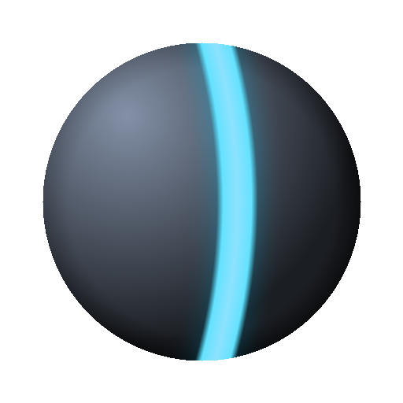 | Starts with one orbiting blade and gains one every 6 seconds, up to five. Each blade deals 7 damage per pass. Taking damage does not remove blades. |
| **Frost** | 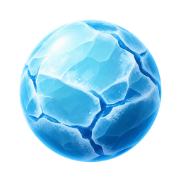 | Leaves a fading ice trail for 2.45 seconds. Enemies freeze for 1.8 seconds and take six ticks of 3 damage, 0.28 seconds apart. Overlapping ice does not stack; a 0.5-second freeze protection follows. |
| **Apple** | 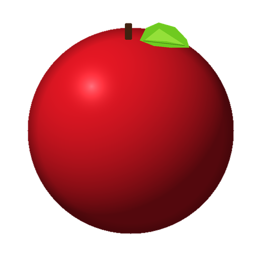 | Drops an apple behind its direction of travel every 1.25 seconds. Allies heal 2 HP; enemies take 5 damage. Each apple can be collected once, lasts 10 seconds, and up to 12 can be active. Apples disappear when their owner is knocked out. |
| **Cactus** | 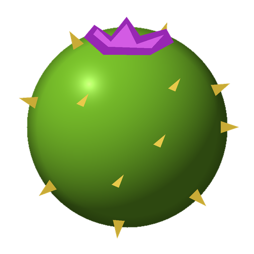 | Plants three cacti after 4 seconds, then every 5 seconds. Enemy contact deals 6 damage and bounces them; allies pass through. Cacti last 5.5 seconds. |
| **Cell Ball** | 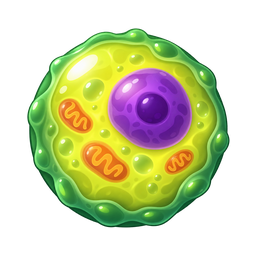 | Starts with 30 HP and grows after 1.8 seconds without a hit, up to 40 HP. A hit that leaves it alive at 32 HP or more splits its remaining HP between two cells. Cells share 4.4 HP/s healing, up to 8 cells and 100 team HP. |
| **Bomb** | 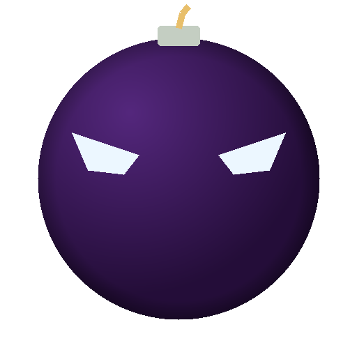 | Drops a bomb every 1.25 seconds. It explodes after 4 seconds for 15 damage and knockback. Each blast hits each enemy once; allies are safe. |
| **Spider** | 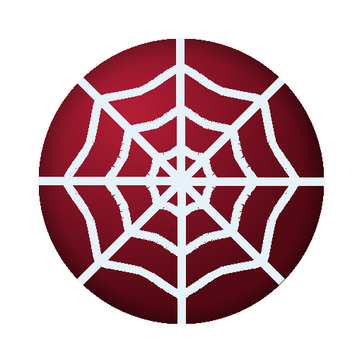 | Each wall bounce leaves a thread attached to the spider. Enemies touching threads slow down and take 1 damage per thread every 0.25 seconds. Up to 32 threads can remain until owner knockout or round end. |
| **Shackle Ball** |  | Creates three rings for 5.2 seconds every 7.5–10.5 seconds. Enemies that fully enter a ring are trapped inside. Each bounce against the inner edge deals 4 damage. |
| **Harpoon** | 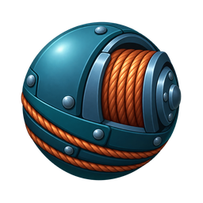 | Fires a bouncing harpoon after 3 seconds and pulls a caught enemy back, dealing 2 damage every 0.12 seconds. The owner stays still and vulnerable during the pull. Freeze, shackles, or knockout interrupt it; recovery takes 2.5 seconds. |
| **Laser** | 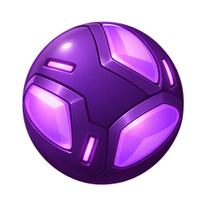 | Wall bounces leave fixed lasers for 5 seconds, up to four active. Each deals 4 damage every 0.5 seconds to enemies in its core. The glow is cosmetic; owner knockout clears the lasers. |
| **Honeycomb** | 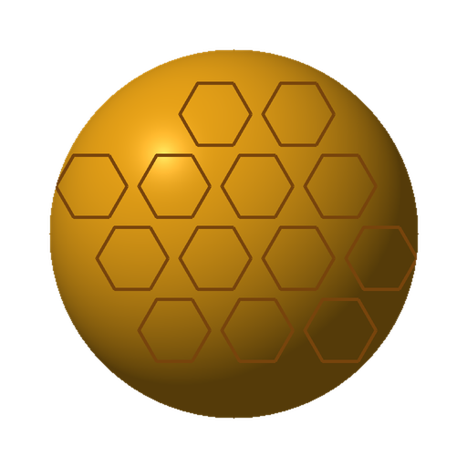 | Sends three seeking bees after 2.5 seconds, then every 4 seconds. Each bee hits once for 2 damage and lasts up to 3 seconds. Up to six bees can be active; allies are safe. |
| **Virus** | 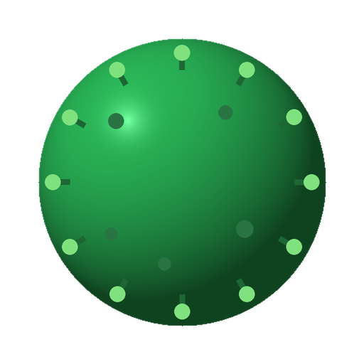 | Contact infects enemies for 4 seconds, dealing 2 damage every 0.75 seconds. Spores apply or extend infection; damage ticks do not stack. |
| **Thief** | 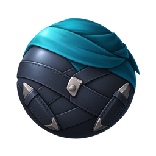 | Throws knives every 2 seconds, starting after 1.5 seconds. Each knife deals 3 damage. At 80/60/40/20 HP it throws 2/3/4/5 knives instead of one; healing lowers the count. Each knife hits once. |
| **Poison Thorn** | 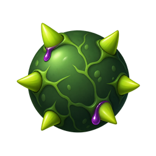 | Three thorns grow on each wall after 3 seconds, then every 7.5 seconds. Thorns last 6 seconds. Contact deals 2 damage plus 2 seconds of poison at 1.05 damage/s. Each thorn can hit an enemy every 0.65 seconds. |
| **Electro** | 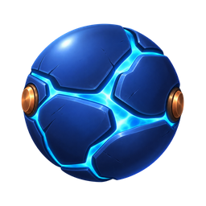 | Fires lightning after 1.6 seconds, then every 3.6 seconds for 6 damage. It chains to one nearby enemy for 3 damage. Contact adds 3 damage and a 0.75-second stop, once per target every 1.6 seconds. |
| **Acid Ball** | 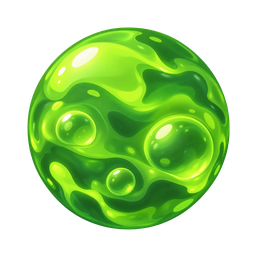 | Fires every 3.2 seconds for 3.15 damage and leaves a puddle for 4 seconds. Puddles deal 2.1 contact damage and burn for 3 seconds, dealing 2 damage every 0.75 seconds. Burns continue outside the puddle and do not stack. |
| **Range** | 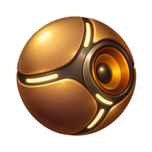 | Sends an expanding wave every 4.5 seconds. Its edge deals 6 damage once per enemy and clears enemy-placed objects and projectiles; attached weapons and active status effects remain. The wave expands for 0.95 seconds. |
| **Snake** | 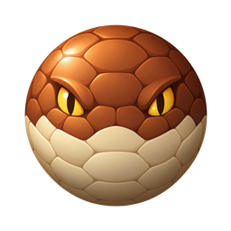 | Grows one tail link every 1.6 seconds, up to five. The tail swings at turns; later links can continue a hit for 0.28 seconds. One strike deals up to 10 base damage, with one push per enemy every 0.8 seconds. |
| **Minigun** | 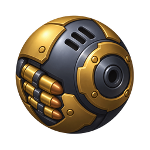 | Fires at the nearest enemy every 0.30 seconds for 1 damage. Dealing or taking a hit pauses firing for 0.35 seconds. Shots have no spread or leading; the first shot comes after 3 seconds. |
| **Shotgun** | 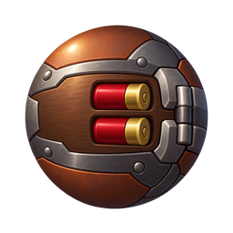 | Fires seven shots in a spread; each hit deals 4 damage. After 8 seconds without taking a hit, it fires a second volley 0.24 seconds later. The first volley fires after 3.5–6 seconds; later volleys after 4.2–7.2 seconds. |
| **Axe** | 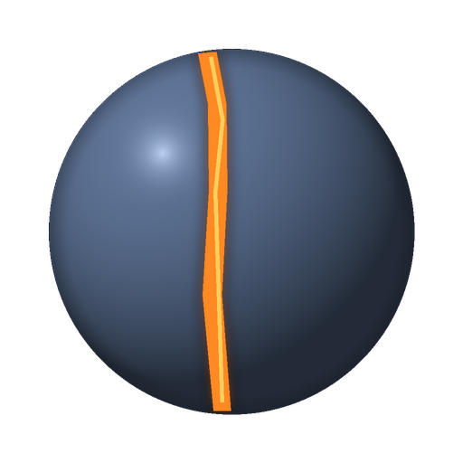 | Starts with 120 HP and a spinning axe. Lower HP makes it spin faster and deal more damage (4–12). Only the blade hits. Freeze and pull stop its rotation. |
| **Glass Ball** | 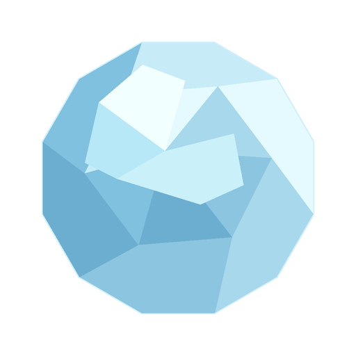 | Wall bounces and incoming hits create glass shards. Each shard deals 4 damage to an enemy, then breaks. Up to 32 shards remain until owner knockout or round end. |
| **Beam Ball** | 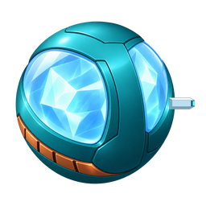 | Charges for 2.5 seconds, then fires for 2 seconds with limited turning speed. Fast enemies can outrun its aim. The first enemy in its 680 cm beam takes 3 damage every 0.25 seconds; it then recharges for 3.75 seconds. |
| **Vampire Ball** | 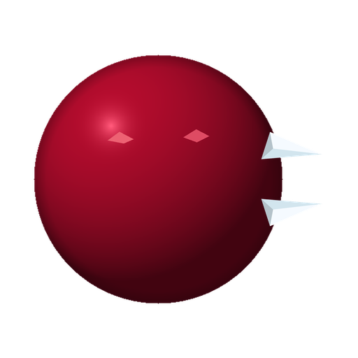 | Latches onto an enemy for 2 seconds while continuing to move. Every 0.5 seconds it deals 4 damage and heals the same amount, up to 120 HP. Freeze, shackles, pull, or a blocked position break the latch. |
| **Pumpkin Ball** · playtime unlock | 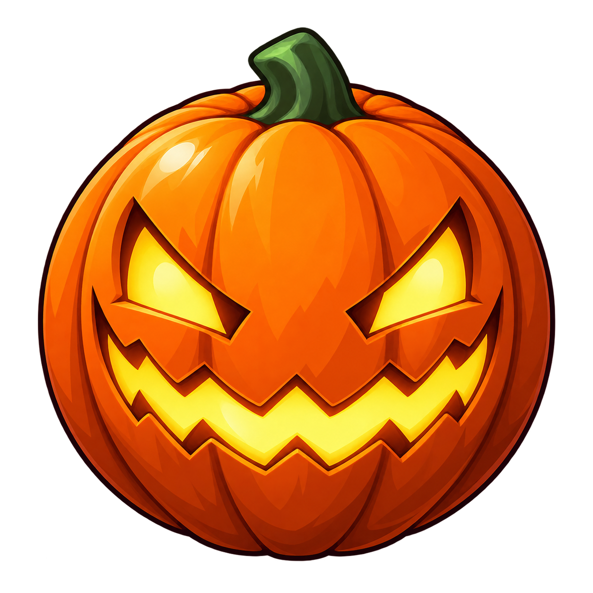 | Leaves a candy pot every 0.7 seconds, up to three active; each expires after 8 seconds. Pots deal 6 damage on contact and drop candies every 0.7 seconds, up to three at a time. They refill after candies are consumed or expire. Each candy deals 4 damage once and expires after 5 seconds. All effects clear on owner knockout. |
