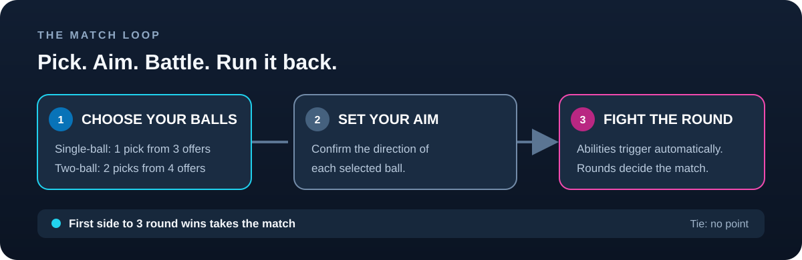
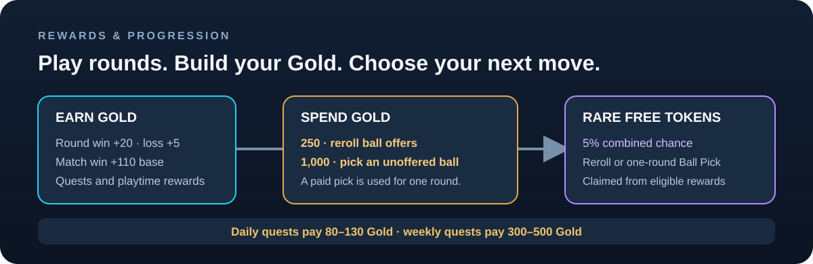
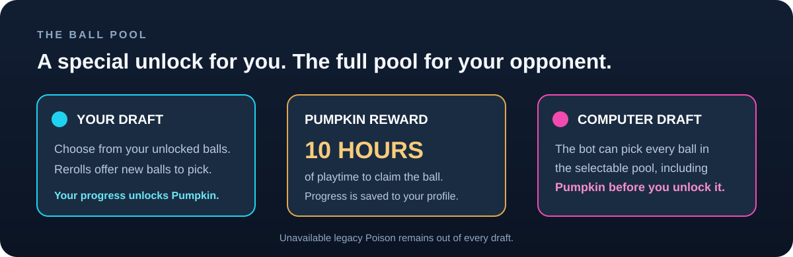

# How BallVsBall works

BallVsBall is a sequence of quick rounds. Choose the ball or balls for the round, set each aim, then let their abilities play out automatically. The first side to win three rounds wins the match. A drawn round awards no match point.

## Choose your lineup

| Mode | Choose | Free offers |
|---|---:|---:|
| Single-ball | 1 ball per side | 3 |
| Two-ball | 2 different balls per side | 4 |

Each side chooses from its own unlocked ball pool. In single-player, the computer makes its picks from the full selectable pool, including the Pumpkin Ball, even before the player unlocks it. A reroll replaces the current offers and clears the player's current picks.

### Aim and battle

After choosing, confirm the aim for each selected ball. The balls then move and activate their abilities according to the rules shown in the [ball catalog](ball-catalog.md). A round win scores one point toward the match. A tie scores neither side. Match progress persists across the rounds in that match.

## Gold and rewards

Players start with **1,000 Gold**. Gold earned in a round or match can be saved and used for later picks and rerolls.

| Activity | Gold |
|---|---:|
| Win a round | +20 |
| Lose a round | +5 |
| Draw a round | +0 |
| Win a match | +110 base, with a win-streak bonus up to +50% |
| Lose a completed match | +30 |
| Claim the 15-minute playtime reward | +80 |
| Claim the 60-minute playtime reward | +240 |
| Daily login / first win | +100 each |
| Daily quest | +80 to +130 |
| Weekly quest | +300 to +500 |

Quest goals vary. They include rounds, wins, damage, knockouts, matches, ball variety, ball families, and rounds played with a particular family. Each player's Gold or token outcome is set when the reward is generated and shown before the goal is complete; it does not reroll when progress changes.

### Gold costs and free reward tokens

- **250 Gold** rerolls the ball offers.
- **1,000 Gold** reserves a pick of an unoffered ball for one combat round. Offered balls remain free.
- Eligible rewards can rarely offer a token instead of Gold: **2%** for a Reroll token or **3%** for a Ball Pick token, before inventory limits. A player can hold one token of each type. A reward cannot offer a token type that the player already owns or has waiting to claim; that blocked outcome pays Gold instead. After using a token, that type can appear again.

## Ball pool and Pumpkin unlock

The catalog contains 25 standard selectable balls and one playtime-reward ball. Players unlock the **Pumpkin Ball** after ten hours of island playtime. The computer opponent has access to all selectable balls, including Pumpkin.

## V-Bucks offers

The island shop offers a one-use reroll for **50 V-Bucks** and a one-round Ball Pick for **100 V-Bucks**. A reroll refreshes the current offers. A Ball Pick selects one available ball outside the free offers; in two-ball mode it covers one of the two balls for that round. A reserved Ball Pick is consumed when combat starts. Both entitlements are limited to this island.

## Source and update policy

This page and the catalog are summaries of the active Verse implementation, not a separate rules engine. Balance, rewards, and unlock timing can change. Recheck the game project before revising a value, and update the diagrams or icons whenever the described behavior changes.

**Verified against the UEFN project: October 1, 2026.**
